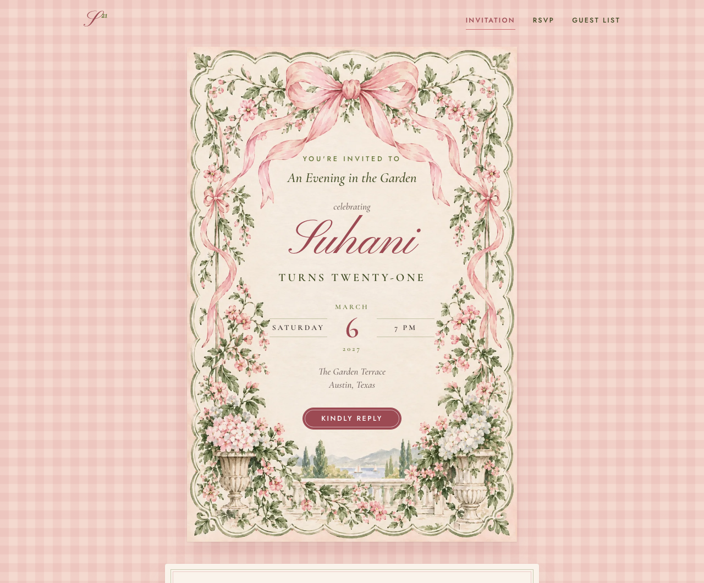
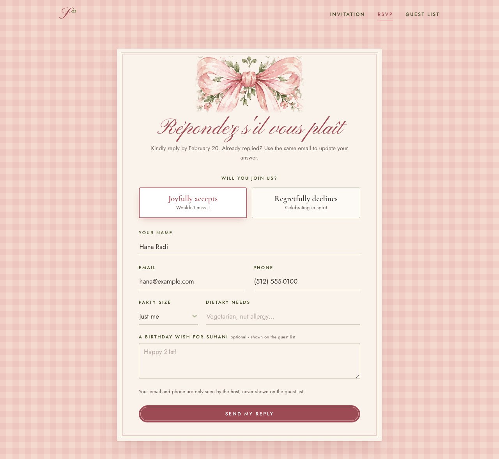
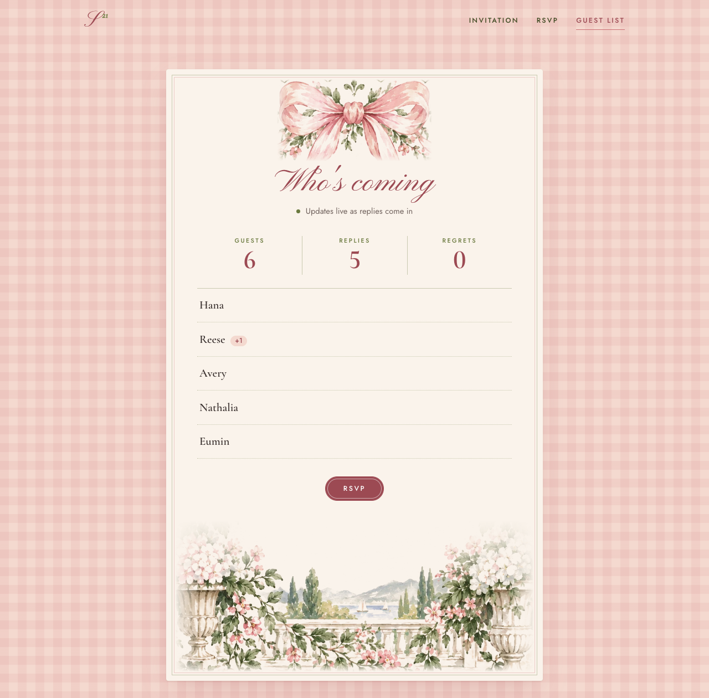
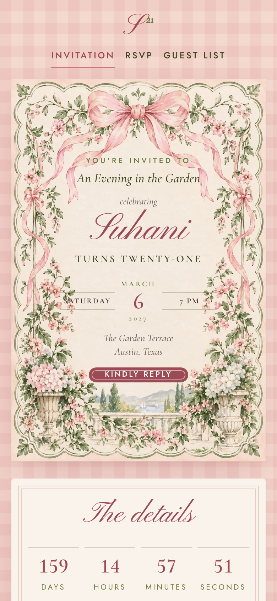

# An Evening in the Garden: Suhani's 21st 🎀

An RSVP site for my 21st birthday, built with **ASP.NET Core MVC** on .NET 10.

It started as Homework 1 in MIS 333K at UT Austin, a tutorial "party invites" app with a form and a list. I got 100 on it, then rebuilt it into something I'd actually send to friends: a watercolor invitation, a live guest list, calendar invites, a real database and a test suite.



| RSVP form | Live guest list | On a phone |
| --- | --- | --- |
|  |  |  |

## Features

- **Invitation card.** Real HTML text sits on the watercolor artwork and scales with CSS container units, so it reads like printed stationery at any screen size.
- **RSVP form.** Accept/decline cards, validation messages written for people, and party size and dietary fields that appear only when you say yes (pure CSS `:has()`, works without JavaScript).
- **One reply per guest.** Emails are normalized, so re-submitting with the same address *updates* your RSVP instead of duplicating it.
- **Live guest list.** SignalR pushes each new RSVP to every open guest-list page, with no refresh needed. It shows names, party sizes and birthday wishes, but never emails or phone numbers.
- **Add to calendar.** A standards-compliant `.ics` download (RFC 5545 escaping and line folding) and a pre-filled Google Calendar link.
- **Countdown** to the party, plus falling petals when you accept (turned off for `prefers-reduced-motion`).
- **RSVP deadline.** The form closes automatically after the reply-by date.
- **Nice link previews.** Open Graph tags and a preview image for when the invite is texted around.

### Under the hood

| Concern | How |
| --- | --- |
| Persistence | EF Core + SQLite, unique index on email |
| Architecture | Thin MVC controller → `IRsvpService` → `DbContext`. Separate input model (`RsvpInput`) so the form can't over-post fields like `Id` |
| Real time | SignalR hub, broadcast from the service after each save |
| Security | Antiforgery tokens, per-IP rate limiting on submissions, `nosniff` / `X-Frame-Options` / `Referrer-Policy` headers, HTML-encoded output, SRI on the CDN script |
| Config | All party details in `appsettings.json`, bound to `EventOptions` |
| Testability | `TimeProvider` is injected, so tests can move the clock past the RSVP deadline |
| Ops | `/health` check (includes the database), friendly 404/429/500 pages, JSON API at `/api/event`, `/api/stats`, `/api/guests` |
| Quality | 23 xUnit integration tests using `WebApplicationFactory`, CI on GitHub Actions, warnings treated as errors |

## Run it

Requires the [.NET 10 SDK](https://dotnet.microsoft.com/download).

```bash
dotnet run --project src/PartyRsvp
# → http://localhost:5000
```

The SQLite database (`party.db`) is created automatically on first run.

```bash
dotnet test
```

## Make it your party

Everything about the event lives in [`src/PartyRsvp/appsettings.json`](src/PartyRsvp/appsettings.json):

```json
"Event": {
  "Honoree": "Suhani",
  "Occasion": "turns twenty-one",
  "Tagline": "An Evening in the Garden",
  "StartsAt": "2027-03-06T19:00:00-06:00",
  "RsvpBy": "2027-02-20T23:59:59-06:00",
  "Location": "The Garden Terrace",
  ...
}
```

## Project layout

```
src/PartyRsvp/
  Controllers/HomeController.cs   invitation, RSVP (GET/POST), guest list, error pages
  Services/RsvpService.cs         save/update replies, stats, SignalR broadcast
  Services/CalendarInvite.cs      .ics + Google Calendar link
  Endpoints/ApiEndpoints.cs       minimal-API JSON endpoints + /event.ics
  Hubs/RsvpHub.cs                 real-time guest list
  Models/                         Rsvp (entity), RsvpInput (form), EventOptions (config), view models
  Views/                          Razor views
  wwwroot/                        CSS, JS, artwork
tests/PartyRsvp.Tests/            integration + unit tests
design/                           source artwork the web images are cut from
```

---

*Originally built for MIS 333K, Homework 1: MVC Tutorial.*
